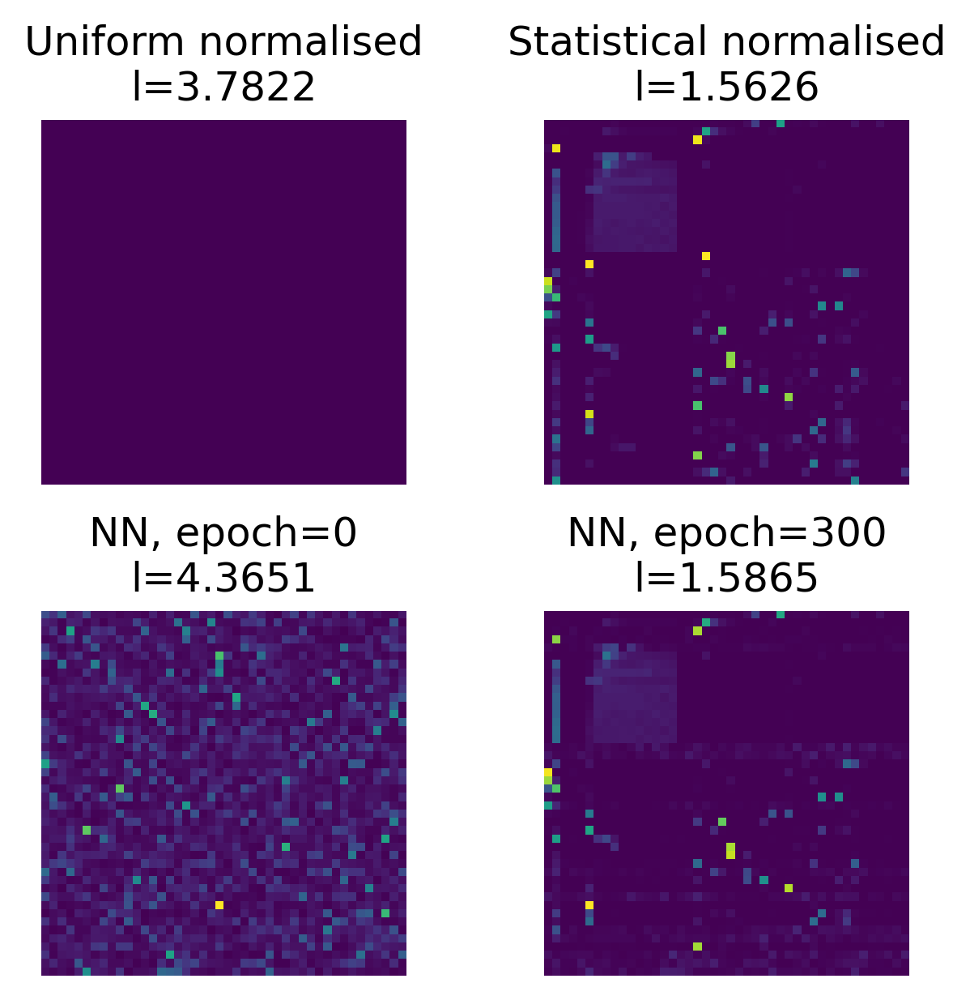
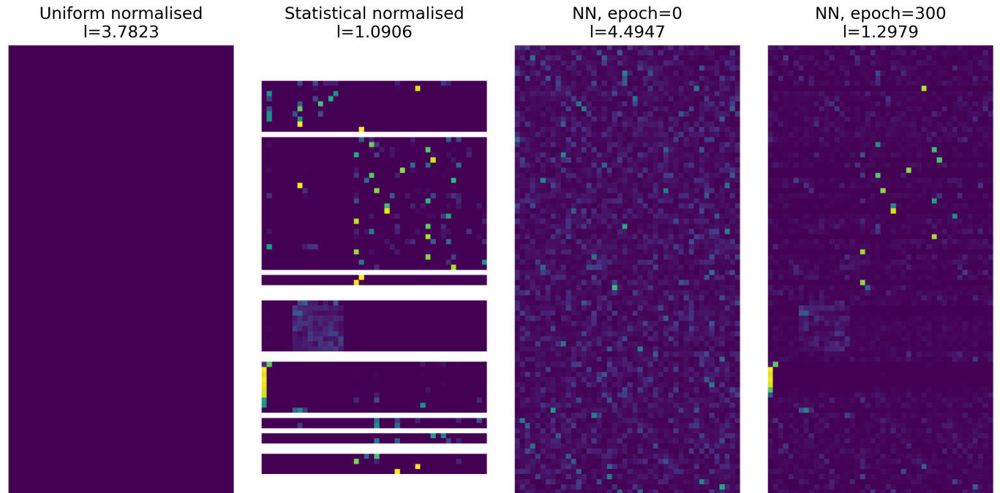

# About

This repository is an **unofficial** companion to Andrej Karpathy's 
[Neural Networks: Zero to Hero](https://www.youtube.com/playlist?list=PLAqhIrjkxbuWI23v9cThsA9GvCAUhRvKZ) video lecture series. 

It's nice to have an image the readme, and here's one from the [notebook](notebooks/2z.%20Lang%201%20-%20Bigrams%20%20-%20TM.ipynb) for lecture 2 based on [exoplanet.eu_names.txt](notebooks/data/exoplanet.eu_names.txt):

The following image is from [notebook](/notebooks/2z.%20Lang%201%20-%20Bigrams%20%20-%20E01%20trigrams.ipynb) for the triagrams exercises for lecture 2:

